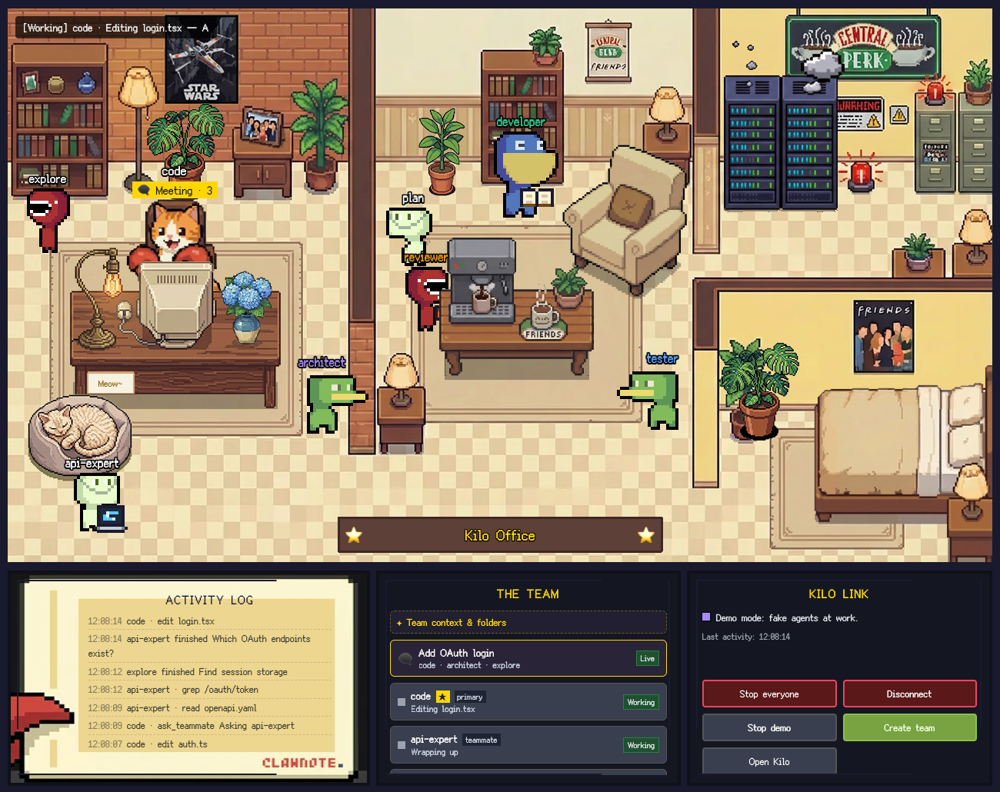
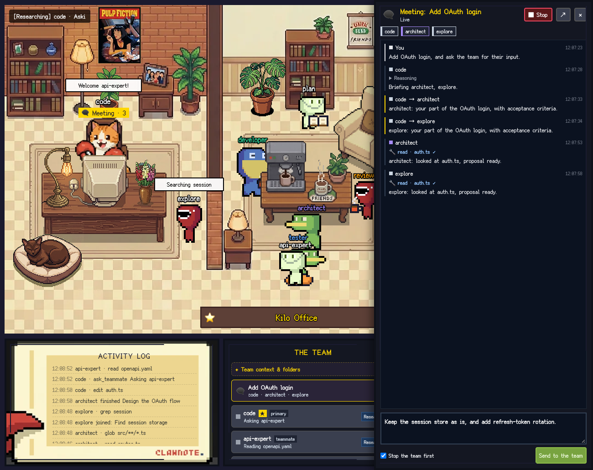
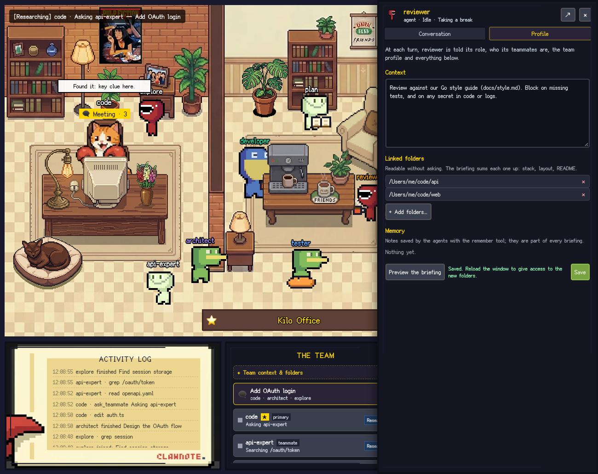

# Star UI for Kilo Code

**A pixel-art office for your [Kilo Code](https://kilo.ai) agents.** Watch your multi-agent team work in real time inside VS Code, follow their meetings, and talk to any of them.



Kilo Code already runs several agents at once: primary agents (Code, Plan, Debug, Orchestrator…), sub-agents it delegates to (Explore, General…), your own custom agents, and parallel sessions in the Agent Manager. But all of that happens in text. Star UI turns it into a little office, forked from [Star-Office-UI](https://github.com/ringhyacinth/Star-Office-UI): every Kilo agent is a character that walks to the room matching what it does. Working agents gather in the office around the lead's desk, with a laptop, a terminal or a book; idle ones take a break in the lounge; an agent in trouble scratches its head in the server room; one waiting for the API naps in the bedroom.

## Features

- **One character per Kilo agent.** Built-in agents, sub-agents, your custom agents and cross-repo teammates all get a seat in the office. Several sessions of the same agent show up as `explore ×3`.
- **Live activity from Kilo Code.** Tool calls, delegation, retries, context compaction, errors and pending approvals are mapped to rooms and animations (see the tables below). Characters walk around walls and furniture.
- **Meetings you can follow.** When an agent delegates to others, they walk to its desk and a *Meeting* marker appears. Click it, or the meeting in the team list, to read the whole thread: your request, the briefs the lead sends to each teammate, their reasoning, the tools they run and their answers, updated live. Finished meetings move to *Past meetings*, under the team, where you can still read them.
- **Redirect the team.** Write to a meeting to change direction. With *Stop the team first*, Star UI stops every agent of the meeting, then sends your message to the lead in the same conversation, so the lead re-plans with its team.
- **Chat with any agent.** Click a character to open its conversation next to the office, with its reasoning and tool calls, and send it a message. It goes through Kilo Code, in the agent's current conversation or a new one, with the model Kilo Code would use. Sub-agents are started as a sub-task, just like an `@mention`.
- **Stop buttons.** Stop one agent (and the sub-agents it started), a whole meeting, or everyone at once.
- **"Needs you" alerts.** When an agent waits for a permission or asks a question, it shows a `!`, the status bar turns orange, and one click opens the conversation in Kilo Code.
- **Agents that know their team.** At every turn, each agent, sub-agents included, is told its role, who its teammates are and what each of them does.
- **Profiles: context, linked folders and memory.** Give the whole team, or one agent, a context of its own (stack, conventions, links) and folders it can read without asking, like other repositories. Agents save lasting notes with a `remember` tool; the notes come back in every briefing. All of it is editable from the office.
- **A virtual team in one command.** *Star UI: Create a Virtual Team of Agents* writes ready-made Kilo agents with detailed role prompts: a manager that plans and dispatches work, and specialists that report back in a common format. Two presets: a general **Software team**, and a **Kubernetes & Go** team for operators and cloud services.
- **Cross-repository teammates.** Declare "the expert of repo X" and "the expert of repo Y": your agents get an `ask_teammate` tool to consult each other across repositories.
- **★ Star Office in the activity bar**, activity log, team list, status bar item and demo mode, in English or French. The office fits the space it has: side by side in a short panel, one tab per panel in a narrow one, with no page scroll.
- **Model-agnostic.** Star UI never talks to a model. Kilo Code keeps using whatever provider you configured (GLM, GPT, Gemini, Mistral, local models…).



## Getting started

1. Install **[Kilo Code](https://marketplace.visualstudio.com/items?itemName=kilocode.kilo-code)** 7 or later and set up your provider as usual. Star UI is tested with Kilo Code 7.6.2 and 7.7.9.
2. Install **Star UI for Kilo Code**. The office opens in an editor tab the first time and, when Kilo Code is installed, a notification offers to connect it.
3. Click **Connect** (or **Connect Kilo** in the office, or run *Star UI: Connect to Kilo Code*), then reload the window.
4. From then on, open the office with the **★ Star Office** icon in the activity bar or the status bar item. It also lives in the bottom panel, next to the terminal.

No Kilo at hand? Run *Star UI: Toggle Demo Mode* to watch fake agents at work.

## How it works

```
Kilo Code (VS Code extension)
  └─ kilo serve  ── loads ~/.config/kilo/plugin/star-ui-kilo.js
                        │  lightweight events (status, tool names, sub-agents, approvals, agent list)
                        ▼
                  127.0.0.1 bridge (random port + token)  ◀── prompts you send from the office
                        │
Star UI for Kilo Code ──┴─ office model ─▶ pixel office (webview) + status bar
```

Kilo Code does not expose an API to other extensions, but it runs the Kilo engine, which loads plugins from `~/.config/kilo/plugin/`. **Connect** installs a small plugin there (`star-ui-kilo.js`). The plugin:

- listens to Kilo's event bus and forwards a **summary** of each agent's activity to the extension;
- receives the messages you type in the office and sends them through Kilo's own, already authenticated client;
- reads a conversation for the office chat when you open it, and stops sessions when you press *Stop*;
- adds a briefing to each agent's system prompt (its role, its teammates, the profiles below), and the `remember` tool;
- lets agents read their linked folders without asking, with Kilo's own permission rules, added when Kilo starts;
- adds the `ask_teammate` tool when cross-repository teammates are configured;
- talks to the extension over `http://127.0.0.1` with `node:http`, and adds `127.0.0.1`, `localhost` and `::1` to `NO_PROXY` in the Kilo process, so a proxy set in VS Code (`http.proxy`) never handles loopback traffic.

**What Connect changes in `~/.config/kilo/`**

- `plugin/star-ui-kilo.js`: the plugin. Updated automatically when the extension updates.
- `package.json`, `package-lock.json` and an empty `node_modules/`: Kilo runs `npm install @kilocode/plugin` in its config folder whenever that folder holds a plugin, and waits for it before loading plugins. Star UI does not need that package, so when Star UI's plugin is the only plugin there and the package is not installed, Connect records `@kilocode/plugin` in `package.json` and `package-lock.json`. Kilo then skips the download. Existing content of these files is kept; nothing is written when other plugins are present or when the package is already installed.

**Disconnect** deletes `plugin/star-ui-kilo.js` only.

Kilo passes the VS Code window that started it to its server, so each window only shows its own Kilo Code agents, plus any `kilo` CLI session running inside the workspace.

The main character (the star, at the desk) follows the agent of your current Kilo Code conversation:

| Kilo activity | Main character |
|---|---|
| reading, searching, browsing (`read`, `grep`, `glob`, `webfetch`, `ask_teammate`…) | desk · researching |
| editing (`edit`, `write`, `patch`, `todowrite`) | desk · working |
| running commands, delegating (`bash`, `task`) | desk · executing |
| thinking / answering | desk · working |
| API retry, offline, context compaction | sync corner |
| error | bug corner |
| waiting for your approval or answer | `!` above the character |
| idle | lounge |

The other agents walk to the room that matches what they do, around walls and furniture:

| Agent | Room | What it does there |
|---|---|---|
| working in the main conversation (delegated by the lead) | office, closest to the lead's desk, with a *Meeting* marker | depends on the activity, as below |
| working on another conversation | office, farther from the desk | |
| · editing, answering | | types on a laptop |
| · thinking | | thought bubble |
| · running commands, delegating | | terminal, spinning gear |
| · reading, searching | | magnifying glass, or a book at the bookshelf |
| · waiting for your approval or answer | | hops, with a `!` |
| error | server room | question marks, head scratching |
| API retry, offline, context compaction | bedroom | asleep on a futon |
| idle | lounge | coffee, reading, beanbag, stretching; they change spot now and then, slowly |

### Which model answers messages sent from the office

The same one Kilo Code would use: the model picked for that agent in Kilo Code, else the last model picked in Kilo Code, else `model` from the Kilo config, else Kilo Code's *default model* settings (`kilo-code.new.model.*`). An agent with its own `model:` keeps it, and a continued conversation keeps its model.

### Privacy and safety

- Everything stays on your machine. The bridge only listens on `127.0.0.1`, uses a random port and token, and rejects browser requests.
- Activity events carry agent names, session titles, tool names and short hints such as a file name, never file contents, prompts, model output or credentials.
- Conversation text (messages, reasoning, tool names and titles) is read only while you have a chat or a meeting open in the office, only for that conversation, and only over `127.0.0.1`. Star UI does not store it: it is shown in the office and dropped when you close the panel. Long messages are truncated.
- The briefing goes to the model with each request, like the rest of the system prompt: the roles of your agents, your profile contexts and notes, and a short summary of each linked folder (its file list, stack, and the start of its `AGENTS.md` or `README.md`). Profiles live in `~/.star-ui-kilo/profiles.json` (readable by you only). Link only folders the model may read.
- The plugin swallows all of its errors, so it cannot break Kilo. Remove it at any time with *Star UI: Disconnect from Kilo Code*.
- No network access: the extension and the plugin only use `127.0.0.1`; the office, fonts and art are bundled.
- Messages sent from the office go through Kilo's normal permission system: Kilo still asks before running commands or editing files. *Stop* uses Kilo's own abort, like the stop button in Kilo Code.

## Your virtual team

Run **Star UI: Create a Virtual Team of Agents**, pick a preset, then the roles, and choose where the team lives:

- **Project** (`.kilo/agent/*.md`): shared with everyone working on the repo, if you commit it;
- **Global** (`~/.config/kilo/agent/*.md`): available in all your projects.

Existing agent files are never overwritten.

**Software team**: manager, architect, ux-designer, developer and tester selected by default; reviewer, docs and devops available.

**Kubernetes & Go**: manager, k8s-architect, go-developer, go-tester, sre and ux-designer selected by default; security-reviewer and docs available.

| Role | Can edit files | Good for |
|---|---|---|
| manager | no (no shell either) | receives the request, splits it, briefs the others with the `task` tool, checks their results, reports |
| architect | no | designs, trade-offs, plans, structure reviews |
| ux-designer | no | API and CLI ergonomics, screens, error messages, documentation flows, accessibility |
| developer | yes | implementing features and fixes with tests |
| tester | yes | test strategy, reproducing bugs with failing tests, running suites |
| reviewer | no | correctness, security, maintainability |
| docs | yes | README, guides, API references, runbooks, changelog |
| devops | yes (asks before `kubectl apply/delete`, `helm install/upgrade/uninstall`, `terraform apply`) | CI/CD, containers, build tooling, release automation |
| k8s-architect | no | operators, CRDs and APIs, reconciliation logic, multi-tenancy, upgrades, failure handling |
| go-developer | yes | controller-runtime, client-go, kubebuilder; idiomatic, tested Go |
| go-tester | yes | table-driven tests, envtest, end-to-end tests on kind, upgrade and failure scenarios |
| sre | yes (asks before `kubectl apply/delete/scale/drain`, `helm install/upgrade/uninstall`, `terraform apply`) | observability, SLOs, upgrades and rollouts, Helm/OLM packaging, incident readiness |
| security-reviewer | no | RBAC, admission, secrets, multi-tenancy isolation, supply chain |

These are plain [Kilo agents](https://kilo.ai/docs). The manager is a primary agent (`mode: primary`): select it in Kilo Code, or click it in the office, and give it the whole task. It must delegate: it cannot edit files or run commands itself. The others use `mode: all`: the manager and Kilo's own agents can delegate to them, and you can talk to each of them directly. Every specialist ends with the same short report (summary, changes, verification, open points), which the manager checks before answering you.

They use the model selected in Kilo Code unless you add a `model:` line, for example a stronger model for the manager and the architect. Edit the Markdown files freely: the office picks up any agent Kilo knows about, including ones you write yourself.

## Profiles: context, linked folders and memory

Every agent already knows its role and its teammates. Profiles add what only you know. Open them from the office:

- **Team profile**: *✦ Team context & folders*, at the top of the team list. Given to every agent.
- **Agent profile**: click a character, then the *Profile* tab. Given to that agent only, on top of the team profile.

Each profile has:

- **Context**: free text, for example your stack, conventions, where the docs live, what to avoid. Used from the next message.
- **Linked folders**: other repositories or folders the agent can read without asking, like additional working directories. The briefing sums each one up (stack, top-level files, start of its README) so the agent knows what is there before looking. Edits in those folders still follow the agent's own permissions. Kilo reads permissions when it starts: reload the window after adding folders.
- **Memory**: notes saved by the agents themselves with the `remember` tool, for themselves or for the whole team (a decision, a convention, a pitfall). They are part of every briefing; delete the ones you do not want from the profile.

*Preview the briefing* shows the exact text an agent receives at each turn.



## Cross-repository teammates

Agents in a Kilo session all work in the same folder. To let an agent consult an expert of **another** repository, run **Star UI: Add a Teammate from Another Repository**, or edit `~/.star-ui-kilo/team.json`:

```json
{
  "members": [
    { "name": "api-expert", "repo": "~/code/my-api", "agent": "ask", "description": "Knows the backend API: routes, auth, database schema" },
    { "name": "web-expert", "repo": "~/code/my-web", "agent": "ask", "description": "Knows the React front-end" }
  ]
}
```

After a reload, every Kilo agent gets an **`ask_teammate`** tool. When the agent working on `my-web` needs to know how the API authenticates, it calls `ask_teammate("api-expert", "…")`. Kilo then opens a session **in `my-api`** with the `ask` agent, waits for the answer and hands it back. Both characters light up in the office while they talk. You can also click a teammate to talk to it directly in its own repository.

- **Loop protection:** a teammate that is being consulted cannot consult other teammates.
- **Read-only teammates:** prefer a read-only agent such as `ask`, or a custom agent with `edit: deny`, so a consultation never modifies the other repository.

## Commands

| Command | What it does |
|---|---|
| Star UI: Open the Office in an Editor Tab | Big view of the office |
| Star UI: Connect to Kilo Code | Installs the Kilo plugin (see [What Connect changes](#how-it-works)) |
| Star UI: Disconnect from Kilo Code | Deletes the Kilo plugin |
| Star UI: Create a Virtual Team of Agents | Writes ready-made Kilo agents |
| Star UI: Add a Teammate from Another Repository | Adds a cross-repo expert to `team.json` |
| Star UI: Edit the Cross-Repository Team File | Opens `team.json` |
| Star UI: Toggle Demo Mode | Fake agents, no Kilo needed |
| Star UI: Open Kilo Code | Focuses the Kilo Code sidebar |
| Star UI: Show Log | Diagnostics |

The **★ Star Office** view in the activity bar opens the office when you click it, and lists these shortcuts: open the office, connect, create a team, demo.

## Settings

| Setting | Default | Description |
|---|---|---|
| `starUiKilo.language` | `en` | `en`, `fr`, or `auto` (follows VS Code) |
| `starUiKilo.officeName` | `""` | Text on the plaque (default "Kilo Office") |
| `starUiKilo.room` | `office` | `office` or `lodge` (snowy mountain lodge) |
| `starUiKilo.scope` | `workspace` | `workspace`: this window's Kilo Code + CLI sessions in the workspace. `all`: every Kilo session on the machine |
| `starUiKilo.showBuiltInAgents` | `true` | Show idle built-in agents (plan, debug, explore…) |
| `starUiKilo.lingerSeconds` | `20` | Time an agent stays at its desk after finishing |
| `starUiKilo.openConversationAfterPrompt` | `false` | Open the Kilo conversation in Kilo Code after sending a message from the office |
| `starUiKilo.statusBar` | `true` | Show the status bar item |
| `starUiKilo.kiloConfigDir` | `""` | Kilo config folder (default `KILO_CONFIG_DIR` or `~/.config/kilo`) |

## Troubleshooting

- **"Plugin installed, waiting for Kilo Code…"**: Kilo loads plugins when it starts. Reload the window, then open Kilo Code once.
- **The Kilo CLI too**: `kilo` in a terminal loads the same plugin. Its sessions appear in the office when they run inside your workspace, or everywhere with `starUiKilo.scope: all`.
- **Remote / WSL / Dev Containers**: install Star UI in the same place Kilo Code runs (the remote side). The extension declares itself as a workspace extension for that reason.
- **Kilo started with `--pure`**: external plugins are disabled in that mode, so the office stays empty.
- **HTTP proxy, no Internet access**: supported, see [How it works](#how-it-works).
- **Kilo Code 4.x / 5.x**: these versions use the legacy engine, which has no plugins. Update to Kilo Code 7 or later.
- **"Kilo Code is still running the previous Star UI plugin"**: the Kilo plugin is updated with the extension, but Kilo loads plugins when it starts. Reload the window.
- **The manager answers without delegating**: some small models skip tool calls. Pick a stronger model for the manager (`model:` in `manager.md`, or in Kilo Code).
- **An agent still asks before reading a linked folder**: reload the window, so Kilo starts with the new folder rules.
- **Hide Kilo's generic sub-agents** (`general`, `explore`) so the team does the work: add `"agent": { "general": { "disable": true }, "explore": { "disable": true } }` to `~/.config/kilo/kilo.jsonc`.

## Development

```bash
npm ci
npm test               # unit tests + the real plugin against the real bridge
npm run build
npm run preview && node dev/serve.mjs   # office + demo in a browser: http://localhost:5317
```

- Press `F5` in VS Code to run the extension in a development host.
- `npm i --no-save @kilocode/cli && KILO_BIN=node_modules/.bin/kilo node scripts/e2e-kilo.mjs` runs an end-to-end check against a real Kilo server. It uses an isolated Kilo config and never touches yours.
- `KILO_EXTENSIONS_DIR=<dir with kilocode.kilo-code installed> npm run test:kilo` runs VS Code with the real Kilo Code extension and checks that its server loads the plugin.
- `E2E_OFFLINE=1` makes npm unreachable during the Kilo end-to-end check; combine it with `HTTP_PROXY` to test proxy handling.
- `npm run preview && node dev/serve.mjs`, then open `http://localhost:5317/?scenario=poses` to see one agent in each state.
- `KILO_BIN=node_modules/.bin/kilo node scripts/team-probe.mjs` creates the virtual team in an isolated Kilo config, gives the manager a task, and lists the agents it delegated to. `PROBE_LOAD_ONLY=1` only checks that Kilo loads every role; `PROBE_ROLES` and `PROBE_MODEL` pick the roles and the model.
- `npm run package` builds the `.vsix`.

Project layout: `src/` holds the extension (bridge, office model, profiles, webview host), `plugin/` the Kilo plugin, `media/` the webview (Phaser scene adapted from Star-Office-UI, `guests.js` for the other agents' map and animations, EN/FR strings, CSS, art), `test/` the tests.

### Releasing

Releases are published by GitHub Actions when a `v*` tag is pushed. The publish job runs in the protected `marketplace` environment and needs the owner's approval. See [RELEASING.md](RELEASING.md).

## Credits and license

- Forked from **[Star-Office-UI](https://github.com/ringhyacinth/Star-Office-UI)** by Ring Hyacinth & Simon Lee: office scene, sprites and the original idea.
- Guest characters: **LimeZu**, [Animated Mini Characters 2](https://limezu.itch.io/animated-mini-characters-2-platform-free).
- Font: **Ark Pixel Font** (SIL OFL 1.1). Engine: **Phaser 3** (MIT).

Code is under the MIT License. **The art assets are not**: their authors allow non-commercial use only, and they must be replaced for any commercial use. See [LICENSE](LICENSE).

This is an independent community project, not affiliated with Kilo Code.

